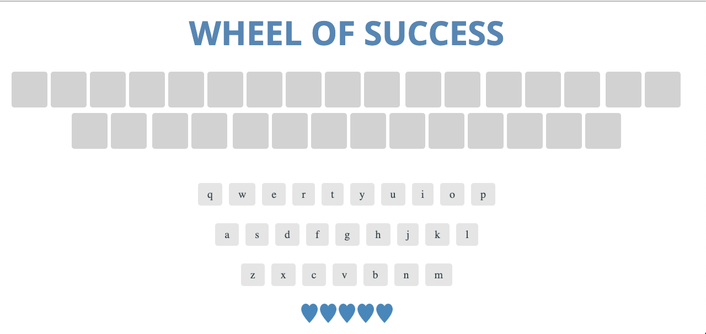

# Game_Show_App_Techdegree
**Game_Show_App_Techdegree** 

This moblie version wheel of success build with html, css and jquery. Have fun!

This app supports keyborad typing and mouse clicking!

The media-query breakpoint is 768px.

You can visit the live version at [https://allan9595.github.io/Game_Show_App_Techdegree/](https://allan9595.github.io/Game_Show_App_Techdegree/)

## How to run on the local machine

git clone https://github.com/allan9595/photo_gallery_techdegree.git

Go to the folder then open the index.html file in browser. 

## Screenshots

## License

    The MIT License

    Copyright (c) BOHAN ZHANG

    Permission is hereby granted, free of charge, to any person obtaining a copy
    of this software and associated documentation files (the "Software"), to deal
    in the Software without restriction, including without limitation the rights
    to use, copy, modify, merge, publish, distribute, sublicense, and/or sell
    copies of the Software, and to permit persons to whom the Software is
    furnished to do so, subject to the following conditions:

    The above copyright notice and this permission notice shall be included in
    all copies or substantial portions of the Software.

    THE SOFTWARE IS PROVIDED "AS IS", WITHOUT WARRANTY OF ANY KIND, EXPRESS OR
    IMPLIED, INCLUDING BUT NOT LIMITED TO THE WARRANTIES OF MERCHANTABILITY,
    FITNESS FOR A PARTICULAR PURPOSE AND NONINFRINGEMENT. IN NO EVENT SHALL THE
    AUTHORS OR COPYRIGHT HOLDERS BE LIABLE FOR ANY CLAIM, DAMAGES OR OTHER
    LIABILITY, WHETHER IN AN ACTION OF CONTRACT, TORT OR OTHERWISE, ARISING FROM,
    OUT OF OR IN CONNECTION WITH THE SOFTWARE OR THE USE OR OTHER DEALINGS IN
    THE SOFTWARE.
